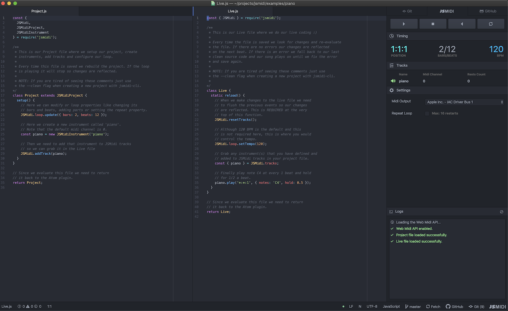

<div align="center">
  <h3>Make Music with JavaScript</h3>
  <br />
  <p>
    JSMidi is a music production tool that works directly with your Digital Audio
    Workstation (DAW) via MIDI. Together with the
    <a href="https://github.com/aaronats/jsmidi-atom">JSMidi Atom Plugin</a>
    you can live code and build songs in JavaScript right inside the
    <a href="https://atom.io">Atom Text Editor</a>. JSMidi uses the
    <a href="https://www.w3.org/TR/webmidi/">Web MIDI API</a> built into the
    browser to control up to 16 MIDI tracks in real time.
  </p>
  <br />
  
</div>

## Table of Contents

1. [Release Notes](#release-notes)
2. [Getting Started](#getting-started)
3. [Overview Documentation](#jsmidi-overview)
  1. [JSMidi Project](#jsmidi-project)
  2. [JSMidi](#jsmidi)
  3. [JSMidi Loop](#jsmidi-loop)
  5. [JSMidi Instrument](#jsmidi-instrument)
4. [JSMidi Examples](#examples)
5. [Logic Pro X: Multitrack & Recording](docs/LOGIC.md)
6. [API Documentation](#api-documentation)
7. [Features Roadmap](#roadmap)
8. [Background and Inspiration](#background)
9. [Contributing](#contributing)

## Release Notes <a name="release-notes"></a>

The initial release was only tested with Mac OSX and Logic Pro X. We now have documentation for
Windows and Ableton Live setup! Garage Band also works, but it only allows for a single MIDI track.
I continue to welcome help adding additional documentation for other DAWs and/or other configuration options.

## Getting Started <a name="getting-started"></a>

The easiest way to get started is to use the
[@jsmidi/cli](https://github.com/aaronats/jsmidi-cli) to build your fist project. There
are a few things you will need to install and configure before you can start coding so
please follow the [Getting Started Guide](docs/GETTING_STARTED.md).

## Overview Documentation <a name="jsmidi-overview"></a>

This is a general overview of the main components that makeup JSMidi. At a high level
JSMidi works by scheduling MIDI event messages with your DAW. It can play any MIDI supported
software instrument or sample installed on your DAW (pianos, synths, drums, etc.).

The overview will cover the following:

1. [JSMidi Project](#jsmidi-project)
2. [JSMidi](#jsmidi)
3. [JSMidi Loop](#jsmidi-loop)
4. [JSMidi Instrument](#jsmidi-instrument)

## JSMidi Project <a name="jsmidi-project"></a>

First we need to understand a little about the project structure before we dive into each
component. The most important parts of a JSMidi Project are the `Project.js` and `Live.js`
files. This is where you will spend the majority of your time when building songs.

NOTE: It is __highly recommended__ to use the
[@jsmidi/cli](https://github.com/aaronats/jsmidi-cli) to create a new project. Please
read the documentation there to get a full grasp of the project structure.

#### Project.js

The `Project.js` file is where we setup the loop, define instruments and add those
instruments as tracks to JSMidi. Below is a minimal `Project.js` file with a single software
instrument and track.

```javascript
const { JSMidi, JSMidiProject, JSMidiInstrument } = require('jsmidi');

class Project extends JSMidiProject {
  setup() {
    JSMidi.loop.update({
      bars: 2, beats: 12, repeat: true
    });

    const piano = new JSMidiInstrument('piano');

    JSMidi.addTracks([piano]);
  }
}

return Project;
```

When JSMidi loads a new project it builds the `Project.js` file first and runs the setup
function. If it builds successfully it moves on to the `Live.js` file to build the song.
Each time the project file is saved we rebuild the file to reflect changes.

#### Live.js

The `Live.js` file is where we "play" our instruments and live code. Below is a minimal
`Live.js` file based on the above `Project.js` file.

```javascript
const { JSMidi } = require('jsmidi');

class Live {
  static reload() {
    JSMidi.resetTracks();
    JSMidi.loop.setTempo(120);

    const { piano } = JSMidi.tracks;

    piano.play('*:*:*', { notes: ['C2', 'E2'], hold: 0.5 });
    piano.play('*:*:1,5', { chord: 'C4m', hold: 2 });
  }
}

return Live;
```

Each time the file is saved JSMidi will rebuild it and your changes will be reflected on
the next beat unless there are errors. If you started with clean source JSMidi will fall
back to that without skipping a beat.


## JSMidi <a name="jsmidi"></a>

JSMidi is a singleton class that provides the shared state and interface we need to
schedule MIDI events, manage tracks and control the loop.

## JSMidi Loop <a name="jsmidi-loop"></a>

At the core of JSMidi is the the JSMidiLoop. It is the master time keeper that controls
the tempo and form or structure of a song. Loops are __position__ based. It is how we define
the form of our songs and also how we schedule instrument actions like playing a note, chord,
pattern or sequence at any position in the loop.

#### Positions

A position in JSMidi is expressed as a __part__, __bar__ and __beat__. `1:1:1`, for example,
is the first position in the loop. When the loop playback is started we simply increment the
position. So the next positions in the loop are `1:1:2`, `1:1:3`, `1:1:4`, etc. based on the
loop's form/structure. How fast the loop increments is determined by the [tempo](#tempo).

NOTE: Positions are one-based meaning that they begin at 1 instead of 0. In programming
of course we are used to things being zero-based. Since a real drummer is not going to count
off 0, 1, 2, 3 neither are we.

#### Bars & Beats

Musical form can largely be expressed in bars and beats. Here is an example loop made of 4
bars and 8 beats. We use the `update` function to change the loop's form.

```javascript
// Update the loop's form.
JSMidi.loop.update({
  bars: 4, beats: 8, repeat: true
});
```

The above will set the loop to run 4 bars and 8 beats. Once it reaches the 4th bar and 8th
beat it will restart at the first bar and beat until it reaches the maximum number of
restarts (default is 16).

#### Parts

Here is an example of a form with parts expressed as an array of bars and beats.

```javascript
// Update the loop's form.
JSMidi.loop.update({
  repeat: true,
  parts: [
    { bars: 1, beats: 8 }, // intro
    { bars: 1, beats: 12 }, // verse 1
    { bars: 1, beats: 8 }, // pre chorus
    { bars: 2, beats: 8 }, // chorus
    // etc.
  ]
});
```

The above sets up a more structured form with different parts broken down into bars
and beats. This is used to build out a full song as opposed to just looping over the
same sequence.

#### Setting Tempo <a name="tempo"></a>

We use __beats per minute (bpm)__ to set the tempo. The default is 120 bpm.

```javascript
// Set the tempo to 110 bpm.
JSMidi.loop.setTempo(110);
```

#### Focus

One of the great features of the JSMidi Loop is focusing on a section of the song that
you are working on. To do that you just give the loop a starting position and an ending
position to repeat. For example, given the loop structure above, if we wanted to focus on
the intro and verse we would set the following.

```javascript
// Focus on a section.
JSMidi.loop.focus('1:1:1', '2:1:12');
```

## JSMidi Instruments <a name="jsmidi-instrument"></a>

JSMidi Instruments are how we "play" software instruments or samples in our DAW.

#### Creating Instruments & Adding Tracks

We can define software instruments in our `Project.js` file and assign them to specific
MIDI channels. When we create instruments we need to add those instruments as tracks
to JSMidi so we can play them in our `Live.js` file.

NOTE: Channels are zero-based in JSMidi. In most DAWs MIDI channels are one-based so
here 0 is the first MIDI channel.

```javascript
// Define our instruments. The default channel is 0.
const drums = new JSMidiInstrument('drums');
const bass = new JSMidiInstrument('bass', { channel: 1 });
const synth = new JSMidiInstrument('synth', { channel: 2 });

// Add to JSMidi tracks.
JSMidi.addTracks([drums, bass, synth]);
```

#### Playing Notes

Once we have our instruments defined we can play those instruments in our `Live.js`
file. Playing a single note or series of notes is very easy using the `play` function.

```javascript
// Play C4 at the first position and hold it for a 1/2 note.
synth.play('1:1:1', { notes: 'C4', hold: 0.5 });
```

The first argument is our __position__ and the second is our __action__.

#### Position Syntax

When we instruct an instrument to take an action we pass it the position(s) in the loop
where we want to take the action(s). We can pass in a single position as a string like
`1:1:1` or `2:1:2`.

We can also pass wildcards with the `*` symbol. This means "every". So `*:*:*` means on
__every__ part, bar and beat (meaning every position). `1:*:1` means the first part, __every__
bar on the first beat.

We can also use a comma separated list for multiple parts, bars and beats. For example, if
we wanted to play a note at `1:1:1`, `1:1:2` and `1:1:3` we can write `1:1:1,2,3` instead
of having to repeat the action for each position.

In addition to using commas to describe multiple positions there is a shorthand method to
describe patterns using the `@` symbol. For example, given a 4 bar 12 beat form, `1:1:@2`
is shorthand for `1:1:2,4,6,8,10,12`. The `@2` expands to every even number. `@1` expands
to every odd number, so `1:1:@1` expands to `1:1:1,3,5,7,9,11`.

This works the same for higher values as well. `1:1:@3` expands to `1:1:3,6,9,12`. `1:1:@4`
will expand to `1:1:4,8,12` and so on.

#### Actions

Actions are the instructions we give to our instruments. This can be a basic object or a JSMidi
Builder function. The builder functions produce the same object but in a chainable and less
verbose syntax.

Here are the available actions and their options:

__ACTIONS:__

- __notes:__ A single note or an array of notes.
  ```javascript
  // as an object
  { notes: 'C4' } // or
  { notes: ['C4', 'G4'] }

  // as a builder function
  notes('C4') // or
  notes(['C4', 'G4'])
  ```
- __chord:__ The [TonalJS](https://github.com/tonaljs/tonal) chord name.
  ```javascript
  // as an object
  { chord: 'A4m' }

  // as a builder function
  chord('A4m')
  ```

__OPTIONS:__

- __velocity:__ The MIDI velocity.
  ```javascript
  // as an object
  { notes: 'C4', velocity: 100 }

  // as a builder function
  notes('C4').v(100); // short
  notes('C4').velocity(100); // long
  ```
- __hold:__ How long to hold a note(s) or a rest.
  ```javascript
  // as an object
  { notes: 'C4', hold: 0.5 }

  // as a builder function
  notes('C4').h(0.5); // short
  notes('C4').hold(0.5); // long
  ```
- __after:__ How long to wait before triggering an aciton.
  ```javascript
  // as an object
  { notes: 'C4', after: 0.5 }

  // as a builder function
  notes('C4').a(0.5); // short
  notes('C4').after(0.5); // long
  ```

Below are some additional examples of instrument actions using the `play` function.

```javascript
const { notes } = JSMidi.builder;

// Play C4 at every first beat and hold it for a 1/2 note.
// Here we use a plain object to indicate the action.
synth.play('*:*:1', { notes: 'C4', hold: 0.5 });

// Here we use a builder function to indicate the same action.
synth.play('*:*:1', notes('C4').h(0.5));

// Play C4, E4 and G4 at every third beat and hold it for 2 whole notes.
// Here we use a plain object to indicate the action.
synth.play('*:*:3', , {
  notes: ['C4', 'E4', 'G4'], velocity: 80, hold: 2
});

// Here we use a builder function to indicate the same action.
synth.play('*:*:1', notes(['C4', 'E4', 'G4']).h(2).v(80));
```

NOTE: If you do not provide a __hold__ option the note(s) will remain on until you
explicitly tell it to stop or the loop stops. For example:

```javascript
// Sends "noteon" with no hold.
synth.play('1:1:1', { notes: 'C4' });

// Sends "noteoff" 2 whole notes later.
synth.stop('1:1:3', { notes: 'C4' });
```

Generally it is easier to provide a __hold__.

#### Playing Chords

Playing chords works in the same way. Pass the [TonalJS](https://github.com/tonaljs/tonal)
chord name you would like to play. Tonal nicely converts the chord name to notes for us.
Please check out their
[documentation on chords](https://github.com/tonaljs/tonal/tree/master/packages/chord).

```javascript
const { chord } = JSMidi.builder;

// Play chord A4 minor at the first
// position and hold it for 1 whole note.
synth.play('1:1:1', { chord: 'A4m', hold: 1 });

// Here we play chord A4 minor with a builder function.
synth.play('*:*:1', chord('A4m').h(1));
```

#### Sequencing

Sequencing is how we schedule ordered events like a base line or solo for example. Sequencing
is simply an easier way to write ordered instrument actions. Below is a simple bass line
starting at position `1:1:1`. Since it is a sequence each note is played in order using
the previous hold to calculate the future time of the next event. The total time for
the sequence is 3 whole notes. The first F2 will play at `1:1:2` and the A2 will play
at `1:1:3`.

NOTE: Each action __must__ have a hold otherwise it will throw an error.

```javascript
const { notes, chord, rest } = JSMidi.builder;

// Single note sequence.
bass.sequence('1:1:1', [
  { notes: 'C3', hold: 0.5 }, // plays at 1:1:1
  { notes: 'C3', hold: 0.5 }, // plays at 1:1:1 after 0.5
  { notes: 'F2', hold: 0.5 }, // plays at 1:1:2
  { notes: 'F2', hold: 0.5 }, // plays at 1:1:2 after 0.5
  { notes: 'A2', hold: 1 }, // plays at 1:1:3
]);

// We can also pass notes, chords and rests.
// This will rest at 1:1:2 and pickup at 1:1:3.
synth.sequence('1:1:1', [
  { notes: ['C3', 'E4'], hold: 1 },
  { rest: true, hold: 1 },
  { chord: 'A4M', hold: 1 },
]);

// Again we can use builder functions to indicate the same sequence.
synth.sequence('1:1:1', [
  notes(['C3', 'E4']).h(1), rest(1), chord('A4M').h(1)
]);
```

#### Patterns

Patterns are generally a tool for drum instruments. It works the same as the sequence
function but has a nicer syntax for playing the same note(s) on a pattern. The first
argument is our position, the second is our action and the last is our pattern (an
array of holds).

```javascript
// Hit the kick drum twice at every odd beat.
drums.pattern('*:*:@1', { notes: 'C2' }, [ 0.5, 0.5 ]);

// The above can be written the same with sequence.
drums.sequence('*:*:@1', [
  { notes: 'C2', hold: 0.5 },
  { notes: 'C2', hold: 0.5 },
]);

// Negative values indicate a rest.
drums.pattern('*:*:1', { notes: 'C2' }, [ 0.5, -0.5, 0.5 ]);
```

#### Rests

Instruments can also rest given a start and end position. This is particularly useful
for drops.

```javascript
// Drop the drums from 1:1:4 to 1:1:8.
drums.rest('1:1:4', '1:1:8');
```

NOTE: I am currently working on support for single and multiple note rests instead of
the entire instrument for more controlled drops.

## API Documentation <a name="api-documentation"></a>

Please see the [API Documentation](https://jsmidi.dev/docs) for the library's full
documentation.

## JSMidi Examples <a name="examples"></a>

I have put together a couple of example projects which you can clone and play with.
Check them out here: [jsmidi-examples](https://github.com/aaronats/jsmidi-examples).

## Features Roadmap <a name="roadmap"></a>

I have a lot of ideas on how to improve JSMidi but I would like to do it with help and
and feedback from the community. The following is my current feature roadmap:

1. Single and multiple note rests for more controlled drops.
2. Map control change MIDI messages to DAW controls and save those mappings. For example,
   in Logic Pro when you assign a knob on your MIDI keyboard to a control in the UI
   (the "learn" feature) it uses simple control change messsages just like a sustain.
   I would like to build virtual control boards for synths, effects, mixing, etc.
3. Port the Atom Plugin to VSCode.

## Background & Inspiration <a name="background"></a>

JSMidi was inspired by the incredible [Sam Aaron](https://github.com/samaaron) and
[Sonic Pi](https://sonic-pi.net/). For years, I have played with Sonic Pi and have
really enjoyed it. Coming from more of a music production perspective I hit some limitations
trying to build songs along side a DAW with Sonic Pi. At the end of the day, if you are
producing music you are using Logic, Ableton, Pro Tools or another perfessional DAW.

When COVID-19 hit and with quarantine in full effect, I had some serious time to throw
at an idea that has been floating around my head for a couple of years. My goals were as
follows:

1. Let DAW's do what they do best. No need to build oscillators, synths, etc.
2. Leverage MIDI and the Web MIDI API to handle all communication with the DAW.
3. Uncouple the editor from the application. Atom (VSCode comming soon) to the rescue.
4. Do it all in JavaScript and make it extremely easy to learn and use.

Also, thanks to [TonalJS](https://github.com/tonaljs/tonal) for making chords so easy
to work with!

## Contributing <a name="contributing"></a>

Thank you for your interest and I welcome/need your help! It is just me right now and
I am starting a new job so my time will be limited but I will do my best to review
pull requests, help with bugs and answer questions as we get a more solid guidline
together.
