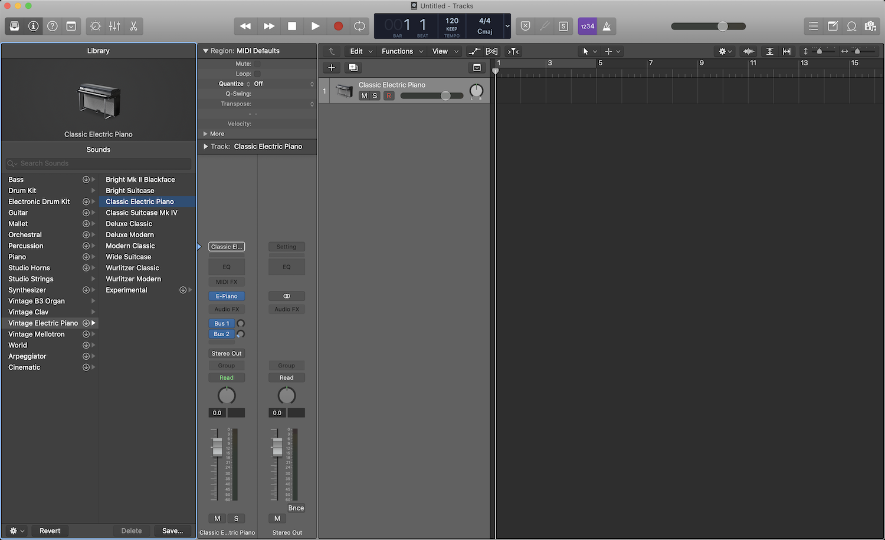

## Getting Started Guide

This guide is designed to get you started with JSMidi and Logic Pro X,
Garage Band or Ableton Live.

##### Requirements

1. A Mac with Logic Pro X or Garage Band or Windows with Ableton Live.
2. [Node JS](https://nodejs.org) and [Node Package Manager](https://www.npmjs.com).
3. [Atom Text Editor](https://atom.io).
4. [JSMidi Atom Package](https://atom.io/packages/jsmidi-atom).
5. [JSMidi CLI](https://github.com/aaronats/jsmidi-cli).

### STEP 1: Audio MIDI Setup for Mac

First, we need to enable the IAC Driver in the Audio MIDI Setup Utility (Open Spotlight
and search for Audio MIDI Setup).


Next double-click the IAC Driver icon to open the properties window.


Finally make sure the option "Device is online" is checked in order to activate it.


### STEP 1: Audio Midi Setup for Windows
First, we need to setup a virtual MIDI bus. Windows does not come with a native MIDI
driver, so we will use [RTP loopMIDI](http://www.tobias-erichsen.de/software/loopmidi.html)  developed by Tobias Erichsen.

[Download loopMIDI](http://www.tobias-erichsen.de/wp-content/uploads/2020/01/loopMIDISetup_1_0_16_27.zip) and install.

Open loopMIDI. Enter a name for the 'new port name'and click the 'plus' icon to add the port.


Once this is done, restart Ableton Live and the ports will appear and can be used to send or receive JSMidi.


On a MIDI track, choose the new port the 'MIDI From' and add an instrument.


### STEP 2: Atom Setup

If you don't have Atom installed, you can download and install it [here](https://atom.io).

Open Atom and navigate to ``Atom->Preferences`` and click on the Install link at the bottom of
the left menu. Search for "jsmidi-atom" in the search bar and install the package.


### STEP 3: JSMidi CLI

First, make sure you have Node JS and NPM installed. If you do not have Node and NPM
the easiest way is to install them both is with [Homebrew](https://brew.sh/).

Next, to install the `@jsmidi/cli` run the following command.

```
$ npm install -g @jsmidi/cli
```

### STEP 4: Creating A New JSMidi Project

Once the `@jsmidi/cli` is installed, navigate to the directory where you would like to create
your project and run the following commands. Where "myproject" is whatever name you
would like to call your project.

```
$ jsmidi new myproject
```

Once your new project is created run the following.

```
$ cd myproject && npm install
```

#### STEP 5: Creating A New Logic Pro X Project

Open Logic Pro X and create a new project `File->New`. Leave the default
"Software Instrument" selected and click create. Note that you can use Garage Band,
but are limited to one MIDI track.


Once you have your new project created. You can select any of the installed software
instruments available in the instrument library. The default is the Classic Electric
Piano.



#### STEP 6: Start Coding!

Finally, open Atom and then open the folder of the new project you created in Step 4.
In the bottom right corner of Atom you will see the JSMidi logo which will toggle the
plugin. Click that and it should open the side bar, your project file and the live file.

In the logs pannel you should see that the Web MIDI API, Project and Live files all
loaded successfully. In the settings section you should also see that the output is
set to: `Apple Inc. - IAC Driver Bus 1`.

That's it! You should be ready to start coding. Press the play button in the control bar
at the top of the JSMidi tab and you should hear note C4 played on every beat.

Please checkout the [UI Cheatsheet](https://github.com/aaronats/jsmidi-atom) and
[read the overview docs](https://github.com/aaronats/jsmidi#jsmidi-overview) for
more information on the loop, instruments, tracks and configuration.


