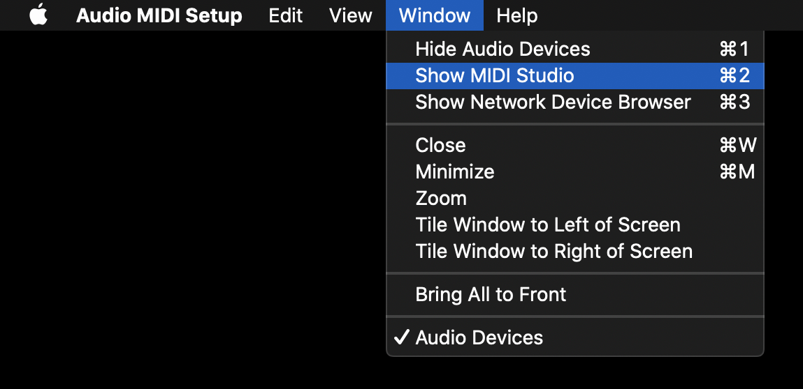
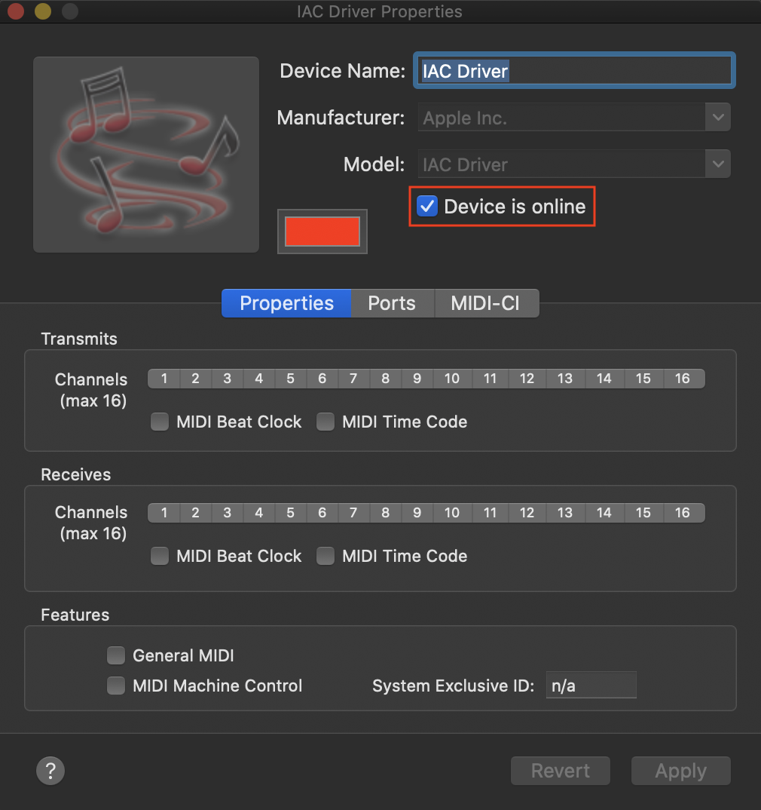
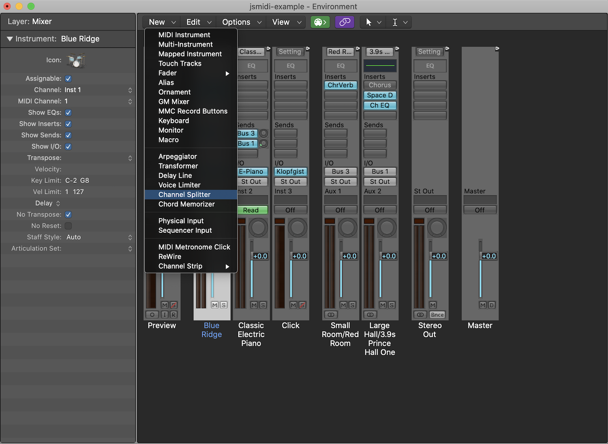
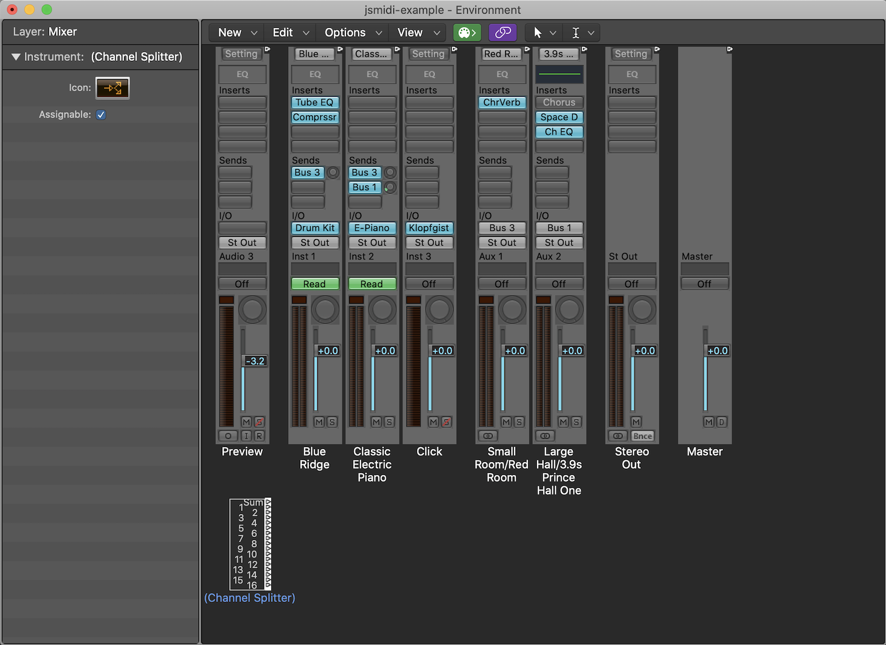
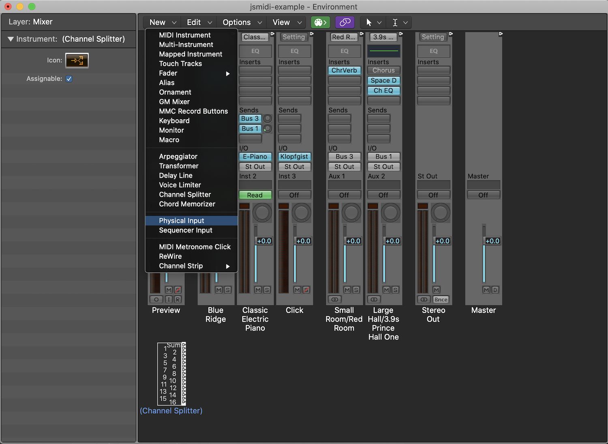

## Logic Pro X Configurations

This page covers configurations in Logic Pro X for MIDI setup, multitrack setup and
recording.

1. [MIDI IAC Driver Setup](#midi-setup)
2. [Multitrack Setup](#multitrack)
  1. [Channel Splitter](#splitter)
  2. [Auto Demix](#splitter)
2. [Recording](#recording)

### MIDI IAC Driver Setup 

To send MIDI to Logic we need to enable the IAC Driver in the Audio MIDI Setup Utility.
You can open Spotlight and search for Audio MIDI Setup to open it.

  

Double-click the IAC Driver icon to open the properties window.

  

Make sure the option "Device is online" is checked in order to activate it.

  

### Multitrack Setup 

There are two ways to deal with multiple MIDI tracks. If you are using multiple tracks
in JSMidi and do not configure Logic correctly all MIDI data will be sent to the first
channel (which sounds terrible).

#### Channel Splitter 

I find the channel splitter to be the easiest way to split up MIDI channels. It does
not work when recording (see below). To add a channel splitter open the `Midi Environment`
in the Window menu. `CMD+0` will open it also.

 

Once the window is open you will see all your different tracks. There are a number of
tracks like the "Click" track that you can ignore. You want to identify the software
instruments that you selected from the main interface.

 

Once you've identified your tracks, take the following steps to add a channel splitter.

1. Add a channel splitter from the `New` dropdown menu.

  
    
  
    

2. Add a physical input from the `New` dropdown menu.

  
    
   
    

3. Connect the Physical Input IAC Driver Bus to the Channel Splitter. This can be a bit tricky
   because the handles are so small. You grab the little triangle thing next to the IAC
   Driver Bus (supposed to be a cable), drag and drop it over the Channel Splitter.

  
    

4. Next connect each software instrument to the correct channel. You do this by dragging the
   little triangle next to the MIDI channel number in the Channel Splitter and dropping it
   on the software instrument for that channel.

  
    
  
    

After you have connected all your software instruments to their correct channels, close
the window and try playing your song. You should hear each instrument separately. Note
that you will have to connect any new instruments you add in the same way.

#### Auto Demix MIDI Channels 

The second method is a bit more annoying in my opinion. It involves assigning each instrument
to the correct MIDI channel in the Track dropdown, setting the Auto Demix by Channel option
and arming each track. This is also required when recording so it is a good idea to
familiarize yourself with this anyway. Follow the steps below to implement this method.

1. In the menu bar go to `Logic->Preferences->Recording` which will open the Logic Preferences
   window. Make sure the `Auto demix by channel if multitrack recording` is checked. You
   can also just leave this checked all the time.

  
    

2. Next set the channel for each track in the main interface under the `Track` dropdown.

  
    

3. Finally, you will need to __make sure__ that each track is armed in the track list.
   The `R` on each track must be red.

  
    

Note that the reason I find this annoying is because if you click on a track to configure
it or something it will sometimes unarm the other tracks. When working on a song I find it
much easier to "hard wire" the channel splitter than mess with arming tracks until it is time
to record.

### Recording   

Recording in JSMidi is pretty straight forward. You record like you would in any other project.
We jsut need to make sure Logic is setup first.

1. Remove the Channel Splitter and Physical Input in the Midi Environment if you have them set.
   You can just select each one and hit the `delete` key.

2. Next folow the instructions above for [Auto Demix MIDI Channels](#auto-demix).

3. Finally, record like you would anything else. Note that when recording multitrack MIDI the
   recording will take place on the selected track and then be "demixed" when it is finished
   and you will see the MIDI data for each track.
